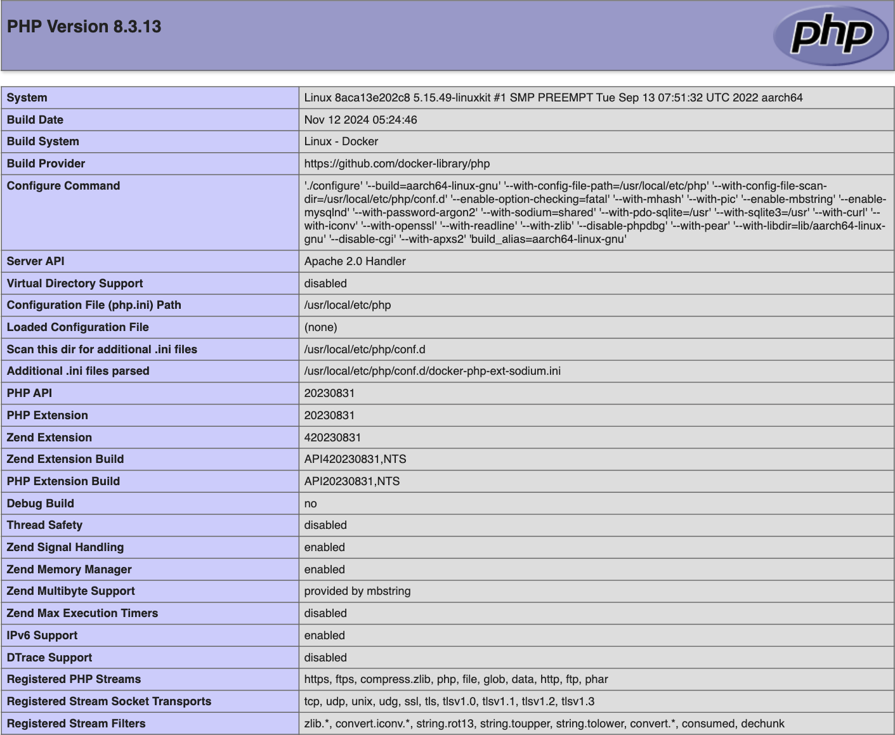

# Übung 1

#### Schuljahr: 24/25
#### Lehrgang: 2
#### Übungstag: 20.11.2024
#### Name: Jakob Lipp
#### Klasse: 3a APC
#### Gruppe: B


## Umsetzung

Es gibt eine PHP funktion die eine Auflistung der PHP version gibt die man am Rechner installiert hat


```php
<?php
  phpinfo();
?>
```



---

## Kommunikationsablauf – Webserver und Client/Browser

### Ablauf:
- Der Browser (Client) sendet eine HTTP/HTTPS-Anfrage an den Webserver.
- Der Webserver verarbeitet die Anfrage, ruft ggf. Daten aus der Datenbank ab und erzeugt die Antwort (z. B. eine HTML-Seite).
- Der Server sendet die Antwort zurück an den Browser.
- Der Browser rendert die empfangene Daten und zeigt sie dem Nutzer.

### Beispiel:
- Client fordert: GET /index.php.
- Server verarbeitet das PHP-Skript und liefert: 200 OK mit HTML-Content.

---

## Installation Entwicklungsumgebung

### Benötigte Tools:
- Webserver (z. B. Apache, Nginx): Dient zur Verarbeitung der Anfragen.
- PHP: Zur Ausführung der serverseitigen Logik.
- Datenbank (z. B. MySQL, MariaDB): Zum Speichern und Abrufen von Daten.
- Editor (z. B. VS Code, PHPStorm): Unterstützt PHP mit Syntax-Hervorhebung.

### Lokale Installation:
Tools wie XAMPP oder MAMP bündeln Webserver, PHP und MySQL in einer einfachen Installation.
Sonnst kann auch ein Docker Container aufgesetzt werden mit Webserver und MySQL

---

## Sicherheitsrisiken von Webanwendungen

### Häufige Bedrohungen:
- Phishing: Nutzer werden auf gefälschte Webseiten gelockt, um persönliche Daten abzugreifen.
- Datendiebstahl: Angriffe auf schlecht gesicherte Datenbanken.
- SQL Injection: Einschleusen von SQL-Code über Formulareingaben.
- Cross-Site-Scripting (XSS): Einschleusen von schädlichem JavaScript in die Webseite.
- Session-Hijacking: Angreifer kapert aktive Sessions eines Nutzers.
- DoS-Attacken: Überlastung des Servers durch eine hohe Anzahl von Anfragen.

---

## Maßnahmen zum Schutz von Webanwendungen

### Verschlüsselung:
- Verwende HTTPS, um Daten während der Übertragung zu schützen.
- Verschlüssele sensible Daten (z. B. Passwörter) mit Hashing-Algorithmen (z. B. bcrypt).

### Multifaktor-Authentifizierung (MFA):
- Kombiniere Passwort mit zusätzlichen Sicherheitsmethoden (z. B. SMS- oder App-basierten Code).

### Sanitizing/Prepared Statements:
- Bereinige Nutzereingaben, um SQL-Injection und XSS-Angriffe zu verhindern.
- Nutze vorbereitete SQL-Statements mit Platzhaltern.

### Sicherheits-Header:
- Setze HTTP-Header wie Content-Security-Policy oder X-Frame-Options.

### Sitzungssicherheit:
- Verwende sichere Cookies und prüfe Session-IDs regelmäßig.

---

## Vorteile von PHP
- Einfach zu lernen – Ideal für Anfänger.
- Weit verbreitet – Große Community und Hosting-Unterstützung.
- Flexibel und effizient – Besonders geeignet für kleinere bis mittelgroße Webprojekte.
- Frameworks und CMS – Unterstützt Tools wie Laravel, WordPress und Joomla.
- Plattformunabhängig – Läuft auf fast allen Servern und Betriebssystemen.

---

## Nachteile von PHP
- Sicherheitsrisiken – Anfällig bei unsauberem Code.
- Geringere Performance – Langsamer als modernere Alternativen wie Node.js.
- Eingeschränkte Skalierbarkeit – Weniger geeignet für große, hochskalierbare Projekte.
- Veraltete Projekte – Viele Legacy-Systeme schwer zu modernisieren.
